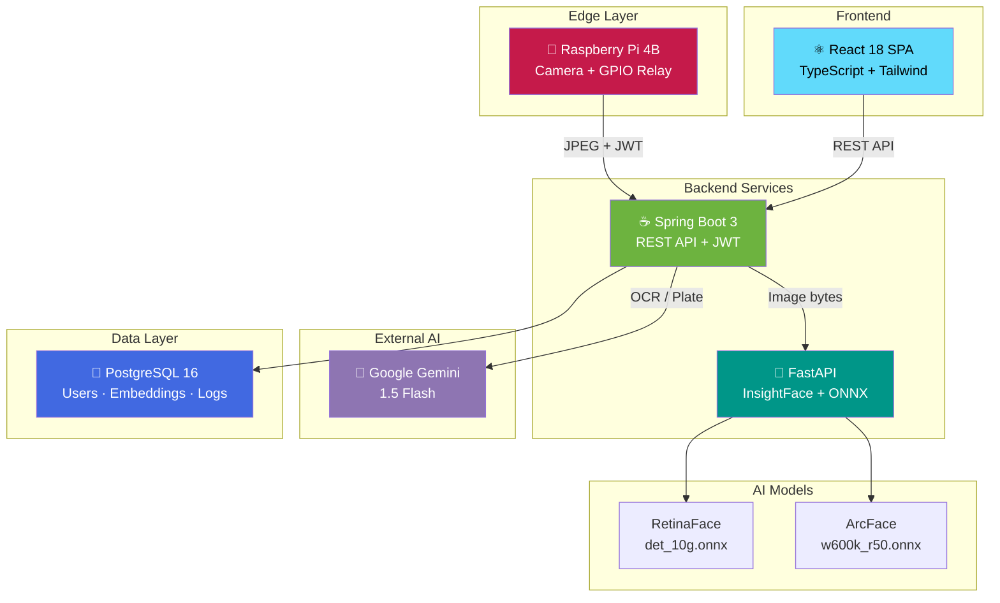

<p align="center">
  
</p>

<h1 align="center">DIU Intelligent Parking System (DIPS)</h1>

<p align="center">
  <strong>An AI-Based Smart University Parking Access Control System<br/>Using Multi-Modal Identity Verification</strong>
</p>

<p align="center">
  <em>Daffodil International University · Department of Computer Science and Engineering</em>
</p>

<p align="center">
  
  
  
  
  
  
  
  
  
  
  
  
</p>

---

## 📌 Table of Contents

- [Introduction](#-introduction)
- [Problem Statement](#-problem-statement)
- [Objectives](#-objectives)
- [Key Features](#-key-features)
- [AI Pipeline — Face Recognition](#-ai-pipeline--face-recognition)
- [OCR Pipeline — University ID Extraction](#-ocr-pipeline--university-id-extraction)
- [Face Enrollment Pipeline](#-face-enrollment-pipeline)
- [Raspberry Pi Gate Integration](#-raspberry-pi-gate-integration)
- [System Architecture](#-system-architecture)
- [Technology Stack](#-technology-stack)
- [Screenshots](#-screenshots)
- [Database Design](#-database-design)
- [API Architecture](#-api-architecture)
- [Security Architecture](#-security-architecture)
- [Performance Engineering](#-performance-engineering)
- [Research Contributions](#-research-contributions)
- [Future Work](#-future-work)
- [Repository Structure](#-repository-structure)
- [Installation & Setup](#-installation--setup)
- [Demo](#-demo)
- [License](#-license)
- [Author](#-author)

---

## 🧠 Introduction

**DIPS** is a production-grade, AI-powered parking access control system engineered to solve real-world campus security and parking inefficiencies at Daffodil International University. The system replaces manual gatekeeping with an autonomous, multi-modal identity verification pipeline that integrates:

- **Deep face recognition** using ArcFace embeddings (512-dimensional) for contactless identity verification
- **Intelligent document extraction** using OCR for university ID card validation
- **License plate verification** using AI-powered detection and Unicode-aware OCR (supporting Bangla characters)
- **IoT-driven gate automation** through a dedicated Raspberry Pi edge device

Unlike conventional parking systems that rely on RFID tags, manual ID checking, or simple barrier arms, DIPS provides a fully automated, AI-first access control pipeline — from camera capture to gate opening — with zero manual intervention.

The project is designed as a deployable system, not an academic prototype. It features a full-stack web application, production database design, JWT-secured REST APIs, fault-tolerant edge computing, and a microservices architecture optimized for real-time inference.

---

## 🔍 Problem Statement

University campuses across Bangladesh face persistent challenges in parking access management:

| Challenge | Impact |
|:---|:---|
| **Manual gatekeeping** | Slow, error-prone, requires dedicated staff at every entry point |
| **Unauthorized parking** | Non-students occupying limited campus slots, leading to congestion |
| **No identity verification** | Security gaps — anyone can enter campus parking without validation |
| **Paper/RFID-based systems** | Easily lost, shared, cloned, or forgotten |
| **Long queues at gates** | Peak-hour bottlenecks during class transitions |
| **Vehicle verification delays** | No way to validate vehicle ownership against student identity |
| **Human errors** | Fatigue-related failures during extended shifts |
| **No real-time data** | Administration has zero visibility into occupancy or utilization |

### How DIPS Solves This

DIPS eliminates these problems through an automated, AI-driven pipeline:

1. A **camera** captures the driver's face as they approach the gate
2. The system performs **1:N face identification** against all enrolled students in < 500ms
3. Upon match, **vehicle registration** is cross-validated against the identified student
4. If both checks pass, the **gate opens automatically** — no card, no button, no waiting
5. **Every access event** is logged with face confidence, timestamp, and decision reason
6. **Security alerts** are generated for anomalies (face mismatch, unregistered vehicles, multiple faces)

---

## 🎯 Objectives

1. Design and implement a **multi-modal identity verification system** combining face recognition, university ID extraction, and vehicle registration verification
2. Develop a **real-time face recognition pipeline** achieving ≥ 95% verification accuracy at FAR ≤ 1% using ArcFace embeddings
3. Build an **intelligent OCR module** for automated extraction of structured data from university ID cards
4. Integrate a **Raspberry Pi edge device** for autonomous, server-dependent gate control with health monitoring and fault recovery
5. Architect a **microservices-based system** with dedicated services for face AI, backend logic, and frontend interaction
6. Implement a **production-grade web application** with guided face enrollment, real-time parking dashboards, and notification systems
7. Deploy a **security event engine** that generates audit trails and alerts for anomalous access patterns

---

## ✨ Key Features

<details>
<summary><strong>🤖 AI & Computer Vision Features</strong></summary>

- **RetinaFace Detection** — Real-time face detection with bounding box and landmark extraction
- **ArcFace Embedding (512-D)** — State-of-the-art face embeddings using `w600k_r50` weights trained on 600K identities
- **Cosine Similarity Matching** — Sub-millisecond 1:N identification using in-memory embedding cache
- **Quality Gate Filtering** — Minimum detection confidence and face area ratio enforcement
- **Guided Multi-Pose Enrollment** — 7-pose capture sequence (center, left, right, up, down, blink, smile)
- **Liveness Detection** — FFT-based texture analysis via SciPy for anti-spoofing
- **Gemini-Powered OCR** — Intelligent document extraction from university ID cards
- **AI Plate Detection** — License plate recognition with Bangla + English Unicode support
- **Fuzzy Plate Matching** — Character-confusion-aware matching (O↔0, I↔1, S↔5, B↔8)

</details>

<details>
<summary><strong>🔒 Security Features</strong></summary>

- **JWT Authentication** — Stateless token-based authentication with configurable expiry
- **BCrypt Password Hashing** — Industry-standard password encryption
- **Role-Based Access Control** — User and Admin role separation
- **Security Event Engine** — Automated CRITICAL/HIGH/MEDIUM severity classification
- **Access Decision Engine** — Rule-based multi-factor verification (Face + Plate → Decision)
- **Audit Logging** — Complete access history with face confidence, plate data, and decision reasoning
- **Secure API Communication** — HTTPS/TLS between all services
- **CORS Protection** — Configurable origin whitelisting

</details>

<details>
<summary><strong>🅿️ Parking Management Features</strong></summary>

- **Real-Time Occupancy Dashboard** — Zone-based availability with utilization metrics
- **Automated Slot Assignment** — Intelligent slot allocation upon verified entry
- **Zone Management** — Multi-zone support (e.g., AB4, Engineering)
- **Statistics & Analytics** — Daily entry/exit counts, utilization rates, peak hour analysis
- **Vehicle Registry** — Full CRUD for registered vehicles with default vehicle selection

</details>

<details>
<summary><strong>🌐 IoT & Edge Computing Features</strong></summary>

- **Raspberry Pi Gate Controller** — Complete edge device firmware with production hardening
- **Automatic JWT Refresh** — Token renewal before expiry to maintain continuous operation
- **Exponential Backoff Retry** — Fault-tolerant communication with configurable retry limits
- **Health Monitoring** — Background checks for camera, backend, internet, and relay subsystems
- **GPIO Relay Control** — Servo/relay actuation for physical barrier gate
- **Event Logging** — Local filesystem logging with rotation and backup
- **Graceful Shutdown** — Signal handling (SIGINT/SIGTERM) for clean subsystem teardown

</details>

<details>
<summary><strong>👤 User Experience Features</strong></summary>

- **Modern React SPA** — Dark-themed, responsive UI with Framer Motion animations
- **Guided Face Enrollment** — Step-by-step webcam capture with real-time pose instructions
- **University ID Upload** — Drag-and-drop document submission with instant AI extraction
- **Notification Center** — In-app notification system for enrollment status, verification events
- **Profile Management** — User profile with extracted university data and enrollment status
- **Landing Page** — Research-grade project showcase with architecture visualization

</details>

---

## 🧬 AI Pipeline — Face Recognition

The face recognition system is built on a two-model architecture using the InsightFace `buffalo_l` model pack, running on ONNX Runtime:

```
┌─────────────────────────────────────────────────────────────────────────────┐
│                         FACE RECOGNITION PIPELINE                          │
│                                                                             │
│  ┌──────────┐   ┌──────────────┐   ┌──────────────┐   ┌───────────────┐   │
│  │  Camera   │──▶│  RetinaFace  │──▶│   ArcFace    │──▶│   Cosine      │   │
│  │  Input    │   │  Detection   │   │  w600k_r50   │   │   Similarity  │   │
│  │ (JPEG)    │   │  det_10g     │   │  (512-D)     │   │   Matching    │   │
│  └──────────┘   └──────┬───────┘   └──────┬───────┘   └───────┬───────┘   │
│                         │                   │                   │           │
│                  ┌──────▼───────┐   ┌──────▼───────┐   ┌──────▼────────┐  │
│                  │ • BBox       │   │ • L2-Norm    │   │ • 1:N Search  │  │
│                  │ • Landmarks  │   │ • 512 floats │   │ • Threshold   │  │
│                  │ • det_score  │   │ • face_score │   │ • ALLOW/DENY  │  │
│                  │ • Quality    │   │   quality    │   │ • Confidence  │  │
│                  │   Gate       │   │   gate       │   │   Score       │  │
│                  └──────────────┘   └──────────────┘   └───────────────┘  │
└─────────────────────────────────────────────────────────────────────────────┘
```

| Stage | Model | Input | Output | Runtime |
|:---|:---|:---|:---|:---|
| **Detection** | RetinaFace (`det_10g.onnx`) | Raw image bytes | Bounding box, 5-point landmarks, detection score | ONNX Runtime (CPU) |
| **Embedding** | ArcFace (`w600k_r50.onnx`) | Aligned face crop | 512-dimensional L2-normalized embedding vector | ONNX Runtime (CPU) |
| **Matching** | Cosine Similarity | Probe vector vs. gallery | Similarity score ∈ [-1, 1] | In-memory (Java) |
| **Decision** | Threshold-based | Similarity score | ALLOW (≥ 0.45) / DENY (< 0.45) | — |

**Key Design Decisions:**
- The **embedding cache** (`ConcurrentHashMap<userId, List<float[]>>`) is loaded at startup from PostgreSQL and refreshed every 5 minutes, ensuring sub-millisecond matching without database queries during verification
- All AI inference runs on the **FastAPI microservice** — Spring Boot communicates via HTTP REST to maintain separation of concerns
- The **quality gate** enforces minimum detection confidence (`min_face_score`) and face-to-image area ratio (`min_face_area_ratio`) before accepting an embedding

---

## 📄 OCR Pipeline — University ID Extraction

The system includes an **intelligent document extraction module** that automatically reads and structures data from university ID cards. This module is powered by the **Google Gemini 1.5 Flash** vision model, configured with prompt-based structured output extraction.

```
┌────────────────────────────────────────────────────────────────────────┐
│                    UNIVERSITY ID EXTRACTION PIPELINE                    │
│                                                                         │
│  ┌──────────────┐   ┌──────────────────┐   ┌───────────────────────┐  │
│  │  ID Card     │──▶│  Gemini 1.5      │──▶│  Structured Data      │  │
│  │  Image       │   │  Flash           │   │  Extraction           │  │
│  │  Upload      │   │  (Vision Model)  │   │                       │  │
│  └──────────────┘   └──────────────────┘   │  • Student Name       │  │
│                                             │  • Student ID         │  │
│                                             │  • University Name    │  │
│                                             │  • Department         │  │
│                                             │  • Session/Batch      │  │
│                                             │  • Confidence Score   │  │
│                                             └───────────┬───────────┘  │
│                                                         │              │
│                                             ┌───────────▼───────────┐  │
│                                             │  Profile Update       │  │
│                                             │  + Validation         │  │
│                                             └───────────────────────┘  │
└────────────────────────────────────────────────────────────────────────┘
```

The extraction module:
- Accepts JPEG/PNG uploads of physical university ID cards
- Sends the image to Gemini with a structured prompt requesting field-by-field extraction
- Parses the response and populates the user's profile with verified institutional data
- Cross-references extracted data for internal consistency validation

---

## 📸 Face Enrollment Pipeline

DIPS implements a **guided multi-pose enrollment protocol** designed to build a robust face gallery for each user:

```
┌──────────────────────────────────────────────────────────────────────┐
│                    GUIDED ENROLLMENT WORKFLOW                         │
│                                                                       │
│  Session Start                                                        │
│       │                                                               │
│       ▼                                                               │
│  ┌──────────┐  ┌──────────┐  ┌──────────┐  ┌──────────┐            │
│  │ CENTER   │─▶│  LEFT    │─▶│  RIGHT   │─▶│   UP     │            │
│  │ 2000ms   │  │ 2000ms   │  │ 2000ms   │  │ 1500ms   │            │
│  └──────────┘  └──────────┘  └──────────┘  └────┬─────┘            │
│                                                  │                   │
│  ┌──────────┐  ┌──────────┐  ┌──────────┐       │                   │
│  │  SMILE   │◀─│  BLINK   │◀─│  DOWN    │◀──────┘                   │
│  │ 2000ms   │  │ 2000ms   │  │ 1500ms   │                           │
│  └────┬─────┘  └──────────┘  └──────────┘                           │
│       │                                                               │
│       ▼                                                               │
│  ┌──────────────────────────────────────────────┐                    │
│  │  ASYNC PROCESSING                             │                    │
│  │  ┌─────────────┐  ┌──────────┐  ┌─────────┐ │                    │
│  │  │ Quality     │─▶│ Embedding│─▶│  Dedup  │ │                    │
│  │  │ Filtering   │  │ Extract  │  │ & Store │ │                    │
│  │  └─────────────┘  └──────────┘  └─────────┘ │                    │
│  └──────────────────────────────────────────────┘                    │
│       │                                                               │
│       ▼                                                               │
│  Enrollment Complete → User.faceEnrolled = true                      │
└──────────────────────────────────────────────────────────────────────┘
```

| Parameter | Value |
|:---|:---|
| Total poses | 7 (center, left, right, up, down, blink, smile) |
| Frames per pose | 4–8 (configurable) |
| Target FPS | 3 |
| Image quality | 90% JPEG |
| Resolution | 640 × 480 |
| Session timeout | 5 minutes |
| Embedding model | ArcFace `w600k_r50` (512-D) |

---

## 🔌 Raspberry Pi Gate Integration

DIPS includes a **complete, production-hardened Raspberry Pi gate controller** written in Python. The Pi operates as a thin client — it captures images and communicates with the backend, but **performs zero local AI processing**. All inference runs server-side.

```
┌─────────────────────────────────────────────────────────────────┐
│                   RASPBERRY PI GATE DEVICE                       │
│                                                                   │
│  ┌────────────┐         ┌────────────────────┐                   │
│  │ USB Camera │────────▶│   GateDevice       │                   │
│  │ (capture)  │         │   Orchestrator     │                   │
│  └────────────┘         │                    │                   │
│                          │   capture → send   │                   │
│  ┌────────────┐         │   → receive → act  │                   │
│  │ GPIO Relay │◀────────│                    │                   │
│  │ (gate arm) │         └─────────┬──────────┘                   │
│  └────────────┘                   │                               │
│                          ┌────────▼──────────┐                   │
│                          │   ApiClient       │                   │
│                          │   (JWT Auth)      │──── HTTPS ────▶  │
│                          │   (Retry Logic)   │    Backend API    │
│                          │   (Health Check)  │                   │
│                          └───────────────────┘                   │
└─────────────────────────────────────────────────────────────────┘
```

**Architecture highlights:**
- **Modular design** — Separate classes for Camera, API Client, Relay Controller, Health Checker, and Logger
- **JWT token management** — Automatic login, token storage, and preemptive renewal before expiry
- **Exponential backoff retry** — Configurable retry with `base=2.0`, `max=60s` for transient failures
- **Background health monitoring** — Periodic checks on camera, backend connectivity, internet, and relay GPIO
- **Signal handling** — Graceful shutdown on `SIGINT`/`SIGTERM` with proper subsystem teardown
- **Structured logging** — Rotating file logger with console output and event-level classification
- **Zero local AI** — All face recognition and decision logic runs on the backend

---

## 🏗 System Architecture



> **[Insert High Resolution System Architecture Diagram Here]**

---

## 🛠 Technology Stack

| Layer | Technology | Version | Purpose |
|:---|:---|:---|:---|
| **Frontend** | React | 18.3 | Component-based UI framework |
| | TypeScript | 5.5 | Static type safety |
| | Vite | 5.4 | Build tool & dev server |
| | Tailwind CSS | 3.4 | Utility-first styling (custom dark theme) |
| | Zustand | 4.5 | Lightweight state management |
| | Framer Motion | 12.x | Animations and transitions |
| | Recharts | 3.8 | Data visualization & charts |
| | React Webcam | 7.2 | Browser camera integration |
| **Backend** | Java | 17 | Core language |
| | Spring Boot | 3.x | REST API framework |
| | Spring Security | 6.x | Authentication & authorization |
| | Spring Data JPA | 3.x | ORM & repository abstraction |
| | Hibernate | 6.x | JPA implementation |
| | Flyway | — | Database schema migration |
| | Lombok | — | Java boilerplate reduction |
| | Resilience4j | — | Circuit breaker & fault tolerance |
| | WebClient | — | Non-blocking HTTP client (→ FastAPI) |
| **Database** | PostgreSQL | 16 | Primary relational database |
| **AI Service** | FastAPI | 0.136 | Python inference microservice |
| | InsightFace | 1.0.1 | Face analysis framework |
| | ONNX Runtime | 1.26 | Optimized model inference |
| | OpenCV | 4.13 | Image decoding & processing |
| | NumPy | 2.4 | Numerical computing |
| | SciPy | ≥1.11 | FFT-based liveness analysis |
| **OCR** | Google Gemini | 1.5 Flash | Vision-based document extraction |
| **IoT** | Raspberry Pi | 4B | Edge gate controller |
| | RPi.GPIO | 0.7+ | GPIO relay control |
| | OpenCV (Pi) | 4.5+ | Camera capture |
| **Auth** | JWT | — | Stateless token authentication |
| | BCrypt | — | Password hashing |
| **Deployment** | Docker | — | Container orchestration |
| | Render | — | Cloud hosting (Frontend + Backend) |

---

## 📸 Screenshots

> **[Insert Login Screen]**

> **[Insert Dashboard]**

> **[Insert Face Enrollment — Guided Multi-Pose Capture]**

> **[Insert Face Verification — Real-Time Matching]**

> **[Insert University ID OCR Extraction]**

> **[Insert Vehicle Registration Management]**

> **[Insert Parking Occupancy Dashboard]**

> **[Insert Notification Center]**

> **[Insert Raspberry Pi Gate Architecture]**

> **[Insert Admin Dashboard]**

> **[Insert System Flow Diagram]**

---

## 🗄 Database Design

The system uses **15 JPA entities** across the following core tables:

| Entity | Purpose |
|:---|:---|
| `User` | Student profiles, enrollment status, university data |
| `Vehicle` | Registered vehicles with plate, make, model, type |
| `FaceEmbedding` | 512-D ArcFace vectors stored as `TEXT` (pgvector-compatible) |
| `FaceEnrollment` | Enrollment records with status tracking |
| `EnrollmentSession` | Guided enrollment sessions with pose completion tracking |
| `EnrollmentFrame` | Individual captured frames with pose labels |
| `LivenessChallenge` | Liveness detection results (FFT texture analysis) |
| `AccessLog` | Complete access audit trail (face + plate + decision) |
| `SecurityEvent` | Anomaly events (face mismatch, multiple faces, unauthorized) |
| `ParkingSlot` | Slot inventory per zone |
| `ParkingAssignment` | Active slot assignments |
| `ParkingScanLog` | Entry/exit scan records |
| `PlateVerificationLog` | Plate detection and matching results |

> **[Insert High Resolution ER Diagram Here]**

---

## 🌐 API Architecture

The backend exposes **20+ RESTful endpoints** organized by domain:

| Module | Endpoints | Auth | Description |
|:---|:---:|:---:|:---|
| **Authentication** | 2 | No | Register, Login |
| **Users** | 2 | JWT | Profile CRUD |
| **Vehicles** | 5 | JWT | Vehicle CRUD with default selection |
| **Face Enrollment** | 3 | JWT | Image enrollment, video upload, status |
| **Enrollment Sessions** | 5+ | JWT | Guided multi-pose enrollment workflow |
| **Face Verification** | 1 | JWT | 1:N face identification |
| **Gate Verification** | 1 | JWT | Raspberry Pi gate endpoint |
| **Access Verification** | 1 | JWT | Multi-modal access decision |
| **Plate Verification** | 1 | JWT | AI plate detection + matching |
| **Document Extraction** | 1 | JWT | University ID OCR |
| **Parking** | 4 | Mixed | Availability, assign, release, statistics |

All endpoints return a standardized `ApiResponse<T>` format:
```json
{
  "success": true,
  "message": "Operation completed",
  "data": { },
  "timestamp": "2026-07-12T08:00:00"
}
```

---

## 🔐 Security Architecture

| Layer | Mechanism | Implementation |
|:---|:---|:---|
| **Authentication** | JWT Bearer Tokens | `JwtTokenProvider` + `JwtAuthenticationFilter` (Spring Security filter chain) |
| **Password Storage** | BCrypt hashing | Spring Security `BCryptPasswordEncoder` |
| **Role-Based Access** | `USER` / `ADMIN` roles | `@PreAuthorize` annotations on controllers |
| **Face Verification** | ArcFace cosine similarity | Threshold-based acceptance (configurable, default 0.45) |
| **University ID Verification** | Gemini OCR extraction | Cross-reference extracted data with user profile |
| **Vehicle Ownership** | Plate matching | Fuzzy matching with character confusion handling |
| **API Security** | CORS + rate limiting | Configurable origin whitelisting, Resilience4j |
| **IoT Communication** | HTTPS + JWT | TLS 1.2+ between Pi and backend |
| **Audit Trail** | Access logs + security events | Every gate event logged with severity classification |

### Access Decision Engine

```
Face Verified + Plate Verified    →  ACCESS_GRANTED
Face Verified + Plate Mismatch    →  SECURITY_ALERT
Face Failed                       →  ACCESS_DENIED
Plate Failed                      →  ACCESS_DENIED
```

Security events are classified by severity: `CRITICAL`, `HIGH`, `MEDIUM` — with event types including `FACE_MISMATCH`, `PLATE_MISMATCH`, `MULTIPLE_FACES`, and `MULTIPLE_PLATES`.

---

## ⚡ Performance Engineering

| Optimization | Implementation | Impact |
|:---|:---|:---|
| **In-Memory Embedding Cache** | `ConcurrentHashMap<userId, List<float[]>>` loaded at startup | Sub-millisecond 1:N matching (eliminates DB queries during verification) |
| **Periodic Cache Refresh** | `@Scheduled` refresh every 5 minutes | Ensures cache stays synchronized with enrollment changes |
| **Gallery-Based Matching** | Multiple embeddings per user (multi-pose) | Improved verification accuracy across varying angles |
| **FastAPI Async** | Uvicorn with async I/O | Non-blocking inference requests |
| **ONNX Runtime** | Optimized CPU inference | ~200ms per embedding extraction on Apple Silicon |
| **Quality Gating** | Pre-embedding rejection of low-quality images | Reduces unnecessary inference on unusable frames |
| **WebClient (Non-blocking)** | Spring WebClient for FastAPI communication | Avoids thread blocking during AI service calls |
| **Lazy Loading** | React code-splitting with dynamic imports | Reduced initial bundle size, faster page loads |

---

## 📚 Research Contributions

This project makes the following contributions to the field of AI-based access control:

1. **Multi-Modal Identity Verification Framework** — A novel integration of three independent verification channels (face biometrics, institutional document OCR, and vehicle registration) into a unified access decision engine with formal decision rules and security event generation.

2. **Guided Multi-Pose Enrollment Protocol** — A 7-pose enrollment workflow (center, left, right, up, down, blink, smile) designed to build robust face galleries that improve verification accuracy across real-world angle variations, with async server-side processing and deduplication.

3. **Edge-Cloud Hybrid Architecture for Campus IoT** — A complete Raspberry Pi thin-client design where the edge device handles only image capture and gate actuation, while all AI inference runs server-side — enabling scalable, maintainable deployment across multiple campus gates without per-device model management.

4. **In-Memory Embedding Gallery with Cache Coherence** — A `ConcurrentHashMap`-based embedding cache with periodic database synchronization, enabling sub-millisecond 1:N face identification without database queries during real-time verification.

5. **Unicode-Aware License Plate Matching** — A character-confusion-aware fuzzy matching algorithm supporting both Bangla and English plate formats, handling common OCR confusions (O↔0, I↔1, S↔5, B↔8).

6. **Production-Grade Security Event Engine** — An automated anomaly detection and classification system that generates severity-rated security events for face mismatches, unauthorized vehicles, and multi-face detection scenarios.

---

## 🔮 Future Work

- **License Plate Recognition (LPR)** — Integrate a dedicated YOLO-based plate detector for higher accuracy than prompt-based OCR
- **Visitor Pass System** — Temporary QR-code-based access for campus visitors with time-limited permissions
- **Mobile Companion App** — React Native app for students to check parking availability and receive gate notifications
- **Edge AI Deployment** — Port lightweight face detection to the Pi using TFLite or NCNN for offline fallback
- **Predictive Parking Analytics** — Machine learning models to forecast parking demand by zone, day, and hour
- **Cloud-Native Deployment** — Kubernetes orchestration with auto-scaling based on gate traffic
- **Federated Learning** — Privacy-preserving model improvement across campus gates without centralizing raw face data
- **Multi-Campus Support** — Extend the architecture to multiple university campuses with centralized management
- **Benchmark Evaluation** — Performance evaluation on LFW, CALFW, and CPLFW public benchmarks for publication

---

## 📁 Repository Structure

```
DIPS/
├── src/                           # React frontend source
│   ├── components/                # Reusable UI components
│   │   ├── face-enrollment/       #   Guided enrollment UI (ImageCapture, ImagePreview)
│   │   ├── vehicles/              #   Vehicle CRUD components
│   │   ├── notifications/         #   Notification center
│   │   └── widgets/               #   Dashboard cards & metrics
│   ├── pages/                     # Application pages
│   │   ├── DashboardPage.tsx      #   Main dashboard with stats
│   │   ├── FaceEnrollmentPage.tsx  #   Multi-pose guided enrollment
│   │   ├── FaceVerificationPage.tsx#   Real-time face matching
│   │   ├── UniversityIdPage.tsx   #   OCR document extraction
│   │   ├── ParkingDashboardPage.tsx#   Occupancy & zone management
│   │   └── LandingPage.tsx        #   Public research showcase
│   ├── services/                  # API service layer (Axios)
│   ├── store/                     # Zustand state management
│   └── types/                     # TypeScript definitions
│
├── backend/                       # Spring Boot backend
│   └── src/main/java/.../
│       ├── controller/            # REST controllers (11 controllers)
│       ├── service/               # Business logic services
│       │   ├── ai/                #   AI service implementations
│       │   │   ├── InsightFaceFaceRecognitionService.java
│       │   │   ├── GeminiServiceImpl.java
│       │   │   └── FaceRecognitionService.java (interface)
│       │   ├── AccessDecisionService.java
│       │   ├── GateVerificationService.java
│       │   ├── EnrollmentSessionService.java
│       │   └── PlateRecognitionService.java
│       ├── entity/                # JPA entities (15 entities)
│       ├── repository/            # Spring Data repositories
│       ├── security/              # JWT auth (Filter, Provider, UserDetails)
│       ├── config/                # Application configuration
│       └── dto/                   # Data transfer objects
│
├── face-ai/                       # Python AI microservice
│   ├── main.py                    # FastAPI application entry
│   ├── app/
│   │   ├── face_service.py        # InsightFace wrapper (detect, embed, quality)
│   │   ├── routes.py              # API routes (/face/enroll, /face/extract-embedding)
│   │   └── config.py              # Pydantic settings
│   ├── evaluation/                # Research evaluation scripts
│   └── requirements.txt           # Python dependencies
│
├── raspberry-pi-gate/             # Raspberry Pi gate controller
│   ├── main.py                    # GateDevice orchestrator
│   ├── camera.py                  # USB camera capture module
│   ├── api_client.py              # Backend API client with JWT & retry
│   ├── relay.py                   # GPIO relay controller
│   ├── health.py                  # Background health checker
│   ├── logger.py                  # Rotating file logger
│   └── config.py                  # Configuration management
│
├── docs/                          # Documentation
│   └── gate-sdk/                  # Raspberry Pi SDK documentation
│
├── public/                        # Static assets (logos, favicons)
├── SYSTEM_ARCHITECTURE.md         # Detailed architecture document
├── API_DOCUMENTATION.md           # Complete API reference
├── RESEARCH_EVALUATION_PLAN.md    # Face recognition evaluation methodology
└── DATASET_COLLECTION_GUIDE.md    # Data collection protocol
```

---

## 🚀 Installation & Setup

<details>
<summary><strong>Prerequisites</strong></summary>

- **Node.js** 18+ and npm
- **Java** 17+ (OpenJDK recommended)
- **Maven** 3.8+
- **PostgreSQL** 15+
- **Python** 3.10+ (3.11 recommended)

</details>

<details>
<summary><strong>1. Frontend (React)</strong></summary>

```bash
# Clone the repository
git clone https://github.com/Sayem2935/DIPS.git
cd DIPS

# Install dependencies
npm install

# Configure environment
cp .env.example .env.development
# Edit .env.development with your backend URL

# Start development server
npm run dev
# → http://localhost:5173
```

</details>

<details>
<summary><strong>2. Backend (Spring Boot)</strong></summary>

```bash
cd backend

# Configure environment
cp .env.example .env
# Edit .env with database credentials, JWT secret, and API keys

# Build
./mvnw clean package -DskipTests

# Run
java -jar target/backend-0.0.1-SNAPSHOT.jar
# → http://localhost:8080
```

**Required environment variables:**
```env
SPRING_DATASOURCE_URL=jdbc:postgresql://localhost:5432/dips_db
JWT_SECRET=your-secret-key-min-32-chars
GEMINI_API_KEY=your-gemini-api-key
```

</details>

<details>
<summary><strong>3. Face AI Microservice (FastAPI)</strong></summary>

```bash
cd face-ai

# Create virtual environment
python -m venv venv
source venv/bin/activate  # Linux/macOS
# venv\Scripts\activate   # Windows

# Install dependencies
pip install -r requirements.txt

# Start server (models load at startup, ~55s on first run)
uvicorn main:app --host 0.0.0.0 --port 8001
# → http://localhost:8001
```

</details>

<details>
<summary><strong>4. Raspberry Pi Gate Device</strong></summary>

```bash
# On the Raspberry Pi:
scp -r raspberry-pi-gate/ pi@gate-pi:~/dips-gate/

# SSH into the Pi
ssh pi@gate-pi
cd dips-gate

# Install dependencies
pip install -r requirements.txt

# Configure
cp config.json config.local.json
nano config.local.json  # Set backend URL, credentials, GPIO pins

# Run
python main.py --config config.local.json
```

</details>

<details>
<summary><strong>5. Docker (Full Stack)</strong></summary>

```bash
cd backend

# Configure environment
cp .env.example .env
# Fill in all required values

# Start all services
docker compose up -d

# Verify
docker compose ps
```

</details>

---

## 🎬 Demo

> **[Insert Demo Video — Full Access Control Flow]**

> **[Insert YouTube Link]**

> **[Insert Architecture Walkthrough Video]**

---

## 📜 License

This project is proprietary software developed for **Daffodil International University**. All rights reserved. Unauthorized reproduction, distribution, or commercial use is prohibited without explicit written permission.

---

## 👤 Author

<table>
  <tr>
    <td align="center">
      <strong>Sayem Uddin</strong><br/>
      <em>Department of Computer Science and Engineering</em><br/>
      <em>Daffodil International University</em><br/><br/>
      <a href="https://github.com/Sayem2935">GitHub</a> ·
      <a href="https://linkedin.com/in/">LinkedIn</a>
    </td>
  </tr>
</table>

---

<p align="center">
  <strong>DIU Intelligent Parking System (DIPS)</strong><br/>
  <em>AI-Based Smart University Parking Access Control Using Multi-Modal Identity Verification</em><br/><br/>
  Daffodil International University · Department of Computer Science and Engineering<br/>
  © 2026 All Rights Reserved
</p>
