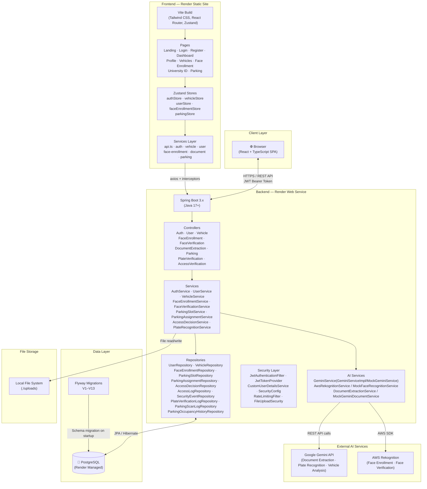
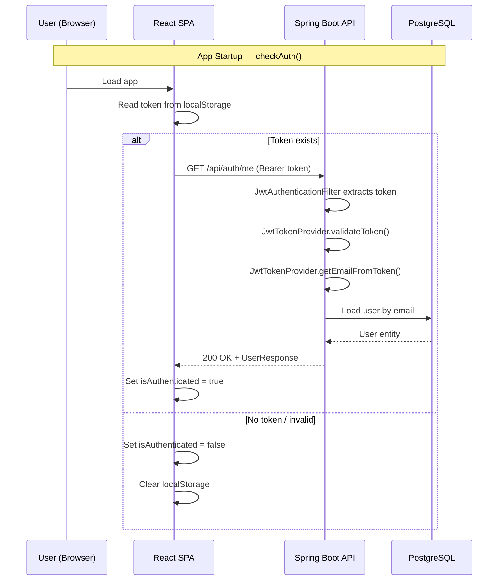
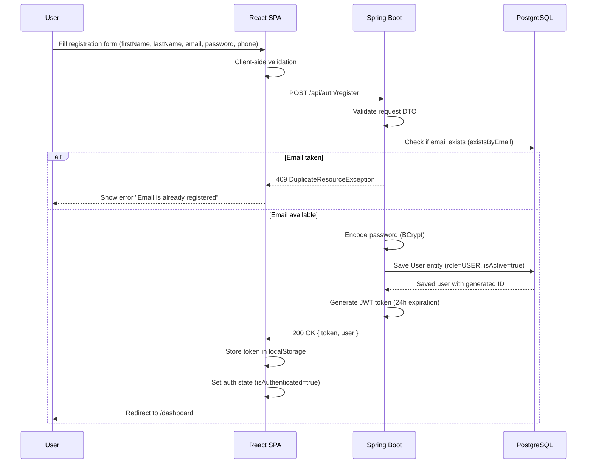
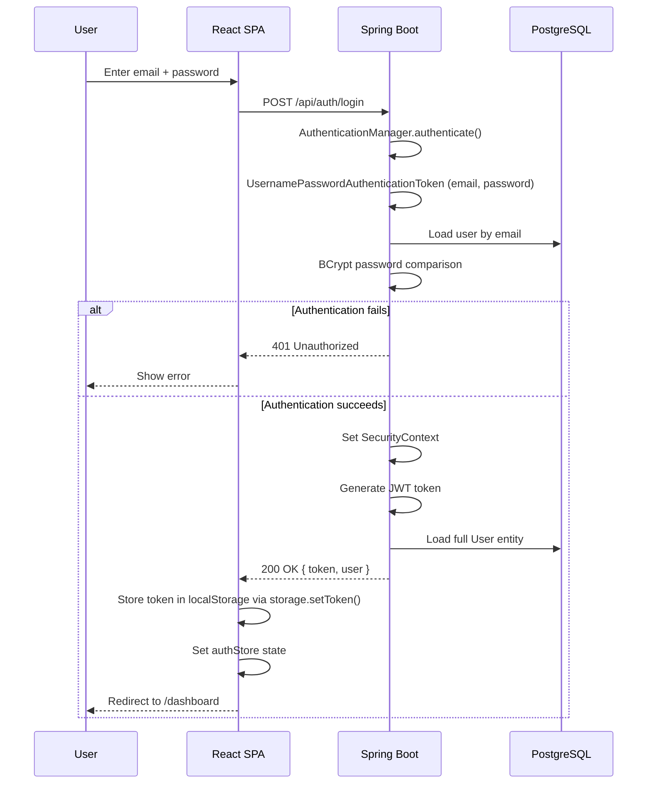
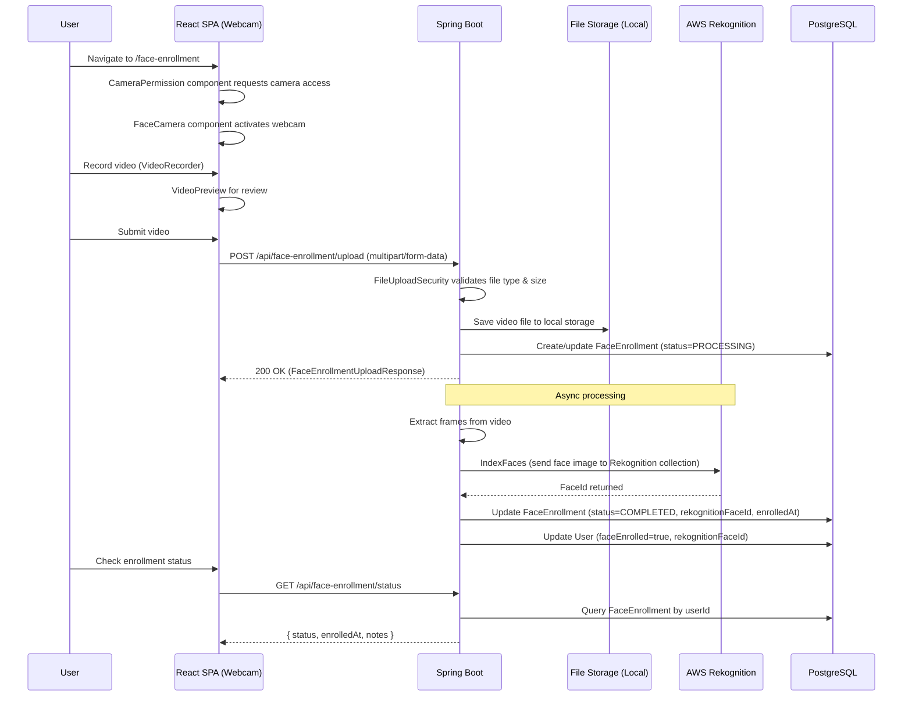
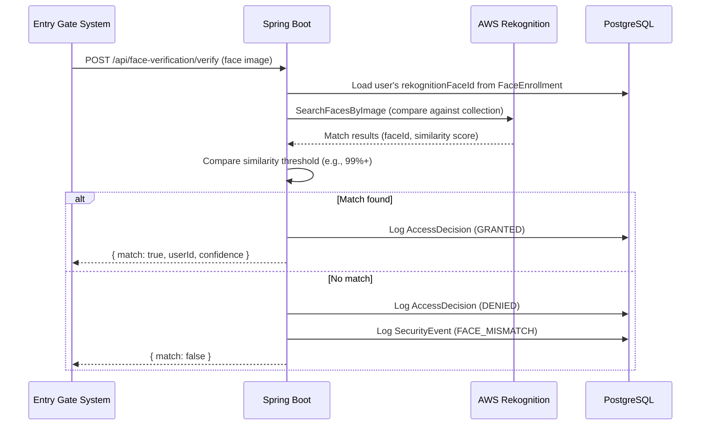
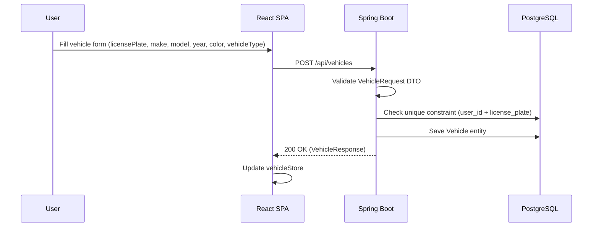
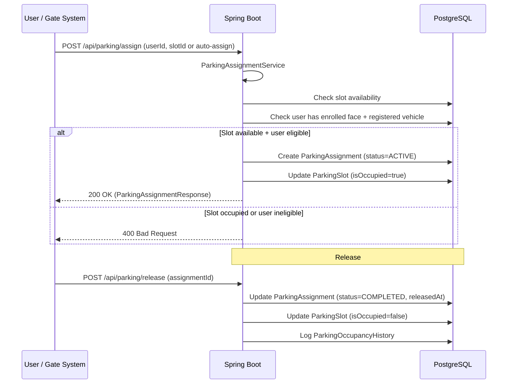
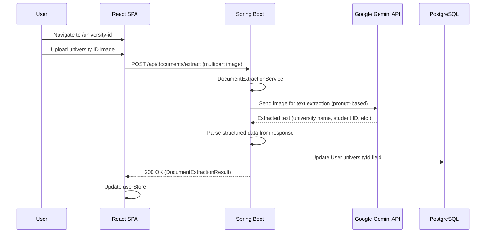
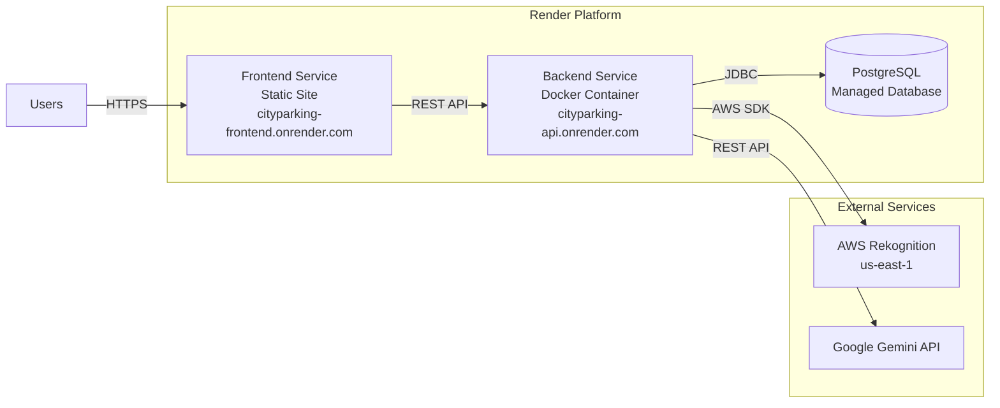

# DIU Intelligent Parking System (DIPS) — System Architecture Document

> **Version:** 1.0  
> **Last Updated:** June 2026  
> **Repository:** https://github.com/Sayem2935/DIPS.git

---

## Table of Contents

1. [High-Level Architecture](#1-high-level-architecture)
2. [Frontend Architecture](#2-frontend-architecture)
3. [Backend Architecture](#3-backend-architecture)
4. [Authentication Flow](#4-authentication-flow)
5. [Registration Flow](#5-registration-flow)
6. [Login Flow](#6-login-flow)
7. [Face Enrollment Flow](#7-face-enrollment-flow)
8. [Face Verification Flow](#8-face-verification-flow)
9. [Vehicle Management Flow](#9-vehicle-management-flow)
10. [Parking Assignment Flow](#10-parking-assignment-flow)
11. [University ID Extraction Flow](#11-university-id-extraction-flow)
12. [Request Lifecycle](#12-request-lifecycle)
13. [Environment Variables](#13-environment-variables)
14. [Third-Party Integrations](#14-third-party-integrations)
15. [Deployment Architecture](#15-deployment-architecture)
16. [Production URLs](#16-production-urls)
17. [Security Architecture](#17-security-architecture)
18. [Future Scaling Recommendations](#18-future-scaling-recommendations)
19. [Known Limitations](#19-known-limitations)
20. [Developer Onboarding Guide](#20-developer-onboarding-guide)

---

## 1. High-Level Architecture

CityParking (DIPS) is a full-stack intelligent parking management system built with a **React + TypeScript SPA** frontend and a **Spring Boot** backend, backed by **PostgreSQL** and integrated with **AWS Rekognition** (face recognition) and **Google Gemini** (AI document analysis & plate recognition). Developed for Daffodil International University.



---

## 2. Frontend Architecture

### 2.1 Technology Stack

| Technology | Purpose |
|---|---|
| React 18 | UI framework with concurrent features |
| TypeScript 5.x | Type-safe development |
| Vite | Build tool & dev server |
| Tailwind CSS 3 | Utility-first styling (dark theme: `#09090b` bg) |
| React Router v6 | Client-side routing with lazy loading |
| Zustand | Lightweight state management (no boilerplate) |
| Axios | HTTP client with interceptors for JWT injection |
| React Webcam | Camera access for face enrollment |

### 2.2 Pages

All pages are **lazy-loaded** via `React.lazy()` with `Suspense` fallback using `PageSkeleton`.

| Page | Route | Auth Required | Description |
|---|---|---|---|
| `LandingPage` | `/` | No | Public marketing/info page; redirects to `/dashboard` if authenticated |
| `LoginPage` | `/login` | No | Email/password login form |
| `RegisterPage` | `/register` | No | First name, last name, email, password, phone registration |
| `DashboardPage` | `/dashboard` | Yes | Main dashboard with metrics, quick actions, status cards |
| `ProfilePage` | `/profile` | Yes | View user profile details |
| `EditProfilePage` | `/profile/edit` | Yes | Edit first name, last name, phone |
| `VehiclesPage` | `/vehicles` | Yes | List all user vehicles |
| `AddVehiclePage` | `/vehicles/add` | Yes | Add a new vehicle |
| `EditVehiclePage` | `/vehicles/:id/edit` | Yes | Edit existing vehicle |
| `FaceEnrollmentPage` | `/face-enrollment` | Yes | Record video for face enrollment |
| `UniversityIdPage` | `/university-id` | Yes | Upload university ID for document extraction |
| `ParkingDashboardPage` | `/parking` | Yes | View parking slots, assignments, statistics |
| `NotFoundPage` | `*` | No | 404 page |

### 2.3 Component Hierarchy

```
src/components/
├── Layout Components
│   ├── Sidebar.tsx          — Desktop navigation sidebar (260px width)
│   ├── Navbar.tsx           — Top navigation bar with user menu
│   ├── BottomNav.tsx        — Mobile bottom navigation
│   └── PageSkeleton.tsx     — Loading skeleton for Suspense fallback
│
├── Shared UI Components
│   ├── Button.tsx           — Styled button with variants (primary, secondary, danger)
│   ├── Card.tsx             — Container card component
│   ├── Input.tsx            — Form input with validation display
│   ├── ErrorMessage.tsx     — Error display component
│   ├── LoadingSpinner.tsx   — Spinner loading indicator
│   ├── SkeletonLoader.tsx   — Skeleton placeholder for content loading
│   ├── EmptyState.tsx       — Empty state placeholder
│   ├── ProtectedRoute.tsx   — Route guard checking auth state
│   └── index.ts             — Barrel exports
│
├── Widget Components (Dashboard)
│   ├── MetricCard.tsx       — KPI metric display card
│   ├── QuickActionCard.tsx  — Quick action button card
│   ├── VerificationBadge.tsx — Verification status badge
│   ├── StatusCard.tsx       — Status overview card
│   ├── EmptyStateCard.tsx   — Empty state for dashboard sections
│   └── index.ts
│
├── Vehicle Components
│   ├── VehicleCard.tsx      — Vehicle display card
│   ├── VehicleForm.tsx      — Add/edit vehicle form
│   ├── DeleteVehicleModal.tsx — Confirmation modal for deletion
│   ├── VehicleEmptyState.tsx — Empty state when no vehicles
│   └── index.ts
│
└── Face Enrollment Components
    ├── CameraPermission.tsx — Camera permission request UI
    ├── FaceCamera.tsx       — Webcam integration for face capture
    ├── VideoRecorder.tsx    — Video recording controls
    ├── VideoPreview.tsx     — Preview recorded video
    ├── EnrollmentProgress.tsx — Progress indicator during enrollment
    └── index.ts
```

### 2.4 State Management (Zustand)

All stores use `zustand` with the `create` function. State is managed per domain:

| Store | File | Key State | Key Actions |
|---|---|---|---|
| `useAuthStore` | `store/authStore.ts` | `user`, `token`, `isAuthenticated`, `isLoading`, `error` | `login()`, `register()`, `logout()`, `checkAuth()`, `clearError()` |
| `useVehicleStore` | `store/vehicleStore.ts` | `vehicles`, `selectedVehicle`, `isLoading` | `fetchVehicles()`, `addVehicle()`, `updateVehicle()`, `deleteVehicle()` |
| `useUserStore` | `store/userStore.ts` | `profile`, `isLoading` | `fetchProfile()`, `updateProfile()` |
| `useFaceEnrollmentStore` | `store/faceEnrollmentStore.ts` | `enrollmentStatus`, `isRecording`, `videoBlob` | `startEnrollment()`, `uploadVideo()`, `checkStatus()` |
| `useParkingStore` | `store/parkingStore.ts` | `slots`, `assignments`, `statistics`, `availability` | `fetchSlots()`, `assignSlot()`, `fetchStatistics()` |

**Auth Persistence Strategy:**
- JWT token is stored in `localStorage` via the `storage` utility (`src/utils/storage.ts`).
- On app startup, `checkAuth()` reads the token from localStorage, calls `GET /api/auth/me` to validate it, and restores the user session.
- `logout()` calls `storage.clearAll()` to remove token + user data.

### 2.5 Services Layer

All services use a shared Axios instance (`src/services/api.ts`) that:
- Sets `baseURL` from `import.meta.env.VITE_API_URL`
- Injects JWT token via request interceptor (`Authorization: Bearer <token>`)
- Handles 401 responses by clearing auth state

| Service | File | Endpoints Called |
|---|---|---|
| `authService` | `auth.service.ts` | `POST /api/auth/login`, `POST /api/auth/register`, `GET /api/auth/me` |
| `userService` | `user.service.ts` | `GET /api/users/profile`, `PUT /api/users/profile` |
| `vehicleService` | `vehicle.service.ts` | `GET /api/vehicles`, `POST /api/vehicles`, `PUT /api/vehicles/:id`, `DELETE /api/vehicles/:id` |
| `faceEnrollmentService` | `face-enrollment.service.ts` | `POST /api/face-enrollment/upload`, `GET /api/face-enrollment/status` |
| `documentService` | `document.service.ts` | `POST /api/documents/extract` |
| `parkingService` | `parking.service.ts` | `GET /api/parking/slots`, `POST /api/parking/assign`, `GET /api/parking/statistics` |

### 2.6 Custom Hooks

| Hook | File | Purpose |
|---|---|---|
| `useAuth` | `hooks/useAuth.ts` | Convenience wrapper around `useAuthStore` |
| `useProfile` | `hooks/useProfile.ts` | Profile fetch/update with loading state |
| `useForm` | `hooks/useForm.ts` | Generic form state management with validation |

### 2.7 Routing Architecture

```
/ (LandingPage — redirects to /dashboard if auth'd)
├── /login (LoginPage — public)
├── /register (RegisterPage — public)
├── /dashboard (DashboardPage — ProtectedRoute + AppShell)
├── /profile (ProfilePage — ProtectedRoute + AppShell)
├── /profile/edit (EditProfilePage — ProtectedRoute + AppShell)
├── /vehicles (VehiclesPage — ProtectedRoute + AppShell)
├── /vehicles/add (AddVehiclePage — ProtectedRoute + AppShell)
├── /vehicles/:id/edit (EditVehiclePage — ProtectedRoute + AppShell)
├── /face-enrollment (FaceEnrollmentPage — ProtectedRoute + AppShell)
├── /university-id (UniversityIdPage — ProtectedRoute + AppShell)
├── /parking (ParkingDashboardPage — ProtectedRoute + AppShell)
└── * (NotFoundPage — public)
```

**AppShell** wraps all authenticated routes and provides:
- Desktop `Sidebar` (hidden on mobile, 260px)
- Top `Navbar`
- Mobile `BottomNav` (hidden on desktop)
- Main content area with responsive padding

---

## 3. Backend Architecture

### 3.1 Technology Stack

| Technology | Purpose |
|---|---|
| Java 17+ | Programming language |
| Spring Boot 3.x | Application framework |
| Spring Security | Authentication & authorization |
| Spring Data JPA / Hibernate | ORM and data access |
| Flyway | Database migration management |
| PostgreSQL | Primary database |
| JWT (jjwt library) | Token-based authentication |
| Lombok | Boilerplate reduction (getter/setter/builder) |
| AWS SDK v2 | Rekognition integration |
| RestTemplate / WebClient | Gemini API HTTP calls |
| Resilience4j | Circuit breaker, retry, rate limiting |
| OpenAPI / Swagger | API documentation |

### 3.2 Package Structure

```
com.cityparking.backend/
├── BackendApplication.java          — Spring Boot entry point
├── config/
│   ├── SecurityConfig.java          — Spring Security filter chain, CORS, endpoint rules
│   ├── AwsProperties.java           — @ConfigurationProperties for AWS
│   ├── GeminiProperties.java        — @ConfigurationProperties for Gemini
│   ├── GeminiConfig.java            — Gemini bean configuration
│   ├── AiProviderConfig.java        — AI provider bean selection (mock vs real)
│   ├── AsyncConfig.java             — @Async thread pool configuration
│   ├── FileUploadSecurity.java      — File upload validation (type, size)
│   ├── OpenApiConfig.java           — Swagger/OpenAPI docs config
│   ├── RateLimitingFilter.java      — Request rate limiting servlet filter
│   ├── ResilienceConfig.java        — Circuit breaker / retry configuration
│   ├── ScheduledCleanupConfig.java  — Scheduled cleanup of temp files/logs
│   └── StartupValidator.java        — Validates critical config on startup
├── controller/
│   ├── AuthController.java          — /api/auth/*
│   ├── UserController.java          — /api/users/*
│   ├── VehicleController.java       — /api/vehicles/*
│   ├── FaceEnrollmentController.java — /api/face-enrollment/*
│   ├── FaceVerificationController.java — /api/face-verification/*
│   ├── DocumentExtractionController.java — /api/documents/*
│   ├── ParkingController.java       — /api/parking/*
│   ├── PlateVerificationController.java — /api/plate-verification/*
│   └── AccessVerificationController.java — /api/access-verification/*
├── dto/
│   ├── auth/
│   │   ├── RegisterRequest.java     — firstName, lastName, email, password, phone
│   │   ├── LoginRequest.java        — email, password
│   │   └── AuthResponse.java        — token, user (UserResponse)
│   ├── user/
│   │   ├── UserResponse.java        — id, firstName, lastName, email, phone, role, universityId, faceEnrolled
│   │   └── UpdateProfileRequest.java — firstName, lastName, phone
│   ├── vehicle/
│   │   ├── VehicleRequest.java      — licensePlate, make, model, year, color, vehicleType, isDefault
│   │   └── VehicleResponse.java     — all vehicle fields + id + timestamps
│   ├── faceenrollment/
│   │   ├── FaceEnrollmentRequest.java
│   │   ├── FaceEnrollmentResponse.java
│   │   ├── FaceEnrollmentStatusResponse.java
│   │   └── FaceEnrollmentUploadResponse.java
│   ├── faceverification/
│   │   └── FaceVerificationResponse.java
│   ├── document/
│   │   └── DocumentExtractionResult.java
│   ├── parking/
│   │   ├── ParkingSlotResponse.java
│   │   ├── ParkingAssignmentResponse.java
│   │   ├── AvailabilityResponse.java
│   │   ├── ParkingScanRequest.java
│   │   ├── AssignSlotRequest.java
│   │   ├── ScanResultResponse.java
│   │   └── ParkingStatisticsResponse.java
│   ├── plateverification/
│   │   ├── PlateDetectionResult.java
│   │   └── PlateVerificationResponse.java
│   ├── accessverification/
│   │   └── AccessVerificationResponse.java
│   └── common/
│       └── ApiResponse.java         — Generic {success, message, data} wrapper
├── entity/
│   ├── User.java                    — Users table entity
│   ├── Vehicle.java                 — Vehicles table entity
│   ├── FaceEnrollment.java          — Face enrollments entity
│   ├── ParkingSlot.java             — Parking slots entity
│   ├── ParkingAssignment.java       — Parking assignments entity
│   ├── ParkingScanLog.java          — Parking scan logs entity
│   ├── ParkingOccupancyHistory.java — Occupancy history entity
│   ├── AccessDecision.java          — Access decisions entity
│   ├── AccessLog.java               — Access logs entity
│   ├── SecurityEvent.java           — Security events entity
│   ├── SecurityEventType.java       — Security event type enum
│   └── PlateVerificationLog.java    — Plate verification logs entity
├── exception/
│   ├── ResourceNotFoundException.java — 404
│   ├── BadRequestException.java       — 400
│   ├── DuplicateResourceException.java — 409
│   └── GlobalExceptionHandler.java    — @RestControllerAdvice for all exceptions
├── repository/
│   ├── UserRepository.java
│   ├── VehicleRepository.java
│   ├── FaceEnrollmentRepository.java
│   ├── ParkingSlotRepository.java
│   ├── ParkingAssignmentRepository.java
│   ├── ParkingScanLogRepository.java
│   ├── ParkingOccupancyHistoryRepository.java
│   ├── AccessDecisionRepository.java
│   ├── AccessLogRepository.java
│   ├── SecurityEventRepository.java
│   └── PlateVerificationLogRepository.java
├── security/
│   ├── JwtAuthenticationFilter.java   — OncePerRequestFilter, extracts Bearer token
│   ├── JwtTokenProvider.java          — Generate, validate, parse JWT tokens
│   └── CustomUserDetailsService.java  — Loads User entity by email for Spring Security
└── service/
    ├── AuthService.java               — Register, login, getCurrentUser
    ├── UserService.java               — Get/update profile
    ├── VehicleService.java            — CRUD for vehicles
    ├── FaceEnrollmentService.java     — Upload video, check status, trigger enrollment
    ├── FaceVerificationService.java   — Verify face against enrolled face
    ├── ParkingSlotService.java        — CRUD parking slots, availability
    ├── ParkingAssignmentService.java  — Assign/release parking spots
    ├── AccessDecisionService.java     — Make access decisions (face + plate combo)
    ├── PlateRecognitionService.java   — ANPR plate detection
    ├── storage/
    │   ├── FileStorageService.java    — Interface for file storage
    │   └── LocalStorageService.java   — Local filesystem implementation
    └── ai/
        ├── FaceRecognitionService.java      — Interface for face recognition
        ├── AwsRekognitionService.java        — AWS Rekognition implementation
        ├── MockFaceRecognitionService.java   — Mock for local/dev testing
        ├── GeminiService.java               — Interface for Gemini AI
        ├── GeminiServiceImpl.java           — Google Gemini API implementation
        ├── MockGeminiService.java           — Mock for local/dev testing
        ├── DocumentExtractionService.java   — Interface for document extraction
        ├── MockGeminiDocumentService.java   — Mock for local/dev testing
        ├── PlateDetectionResult.java        — Plate detection result DTO
        ├── VehicleAnalysisResult.java       — Vehicle analysis result DTO
        └── ParkingDetectionResult.java      — Parking detection result DTO
```

### 3.3 Controllers (API Endpoints)

| Controller | Base Path | Key Endpoints | Auth |
|---|---|---|---|
| `AuthController` | `/api/auth` | `POST /register`, `POST /login`, `GET /me` | `/register`, `/login` are public |
| `UserController` | `/api/users` | `GET /profile`, `PUT /profile` | Yes |
| `VehicleController` | `/api/vehicles` | `GET /`, `POST /`, `PUT /{id}`, `DELETE /{id}` | Yes |
| `FaceEnrollmentController` | `/api/face-enrollment` | `POST /upload`, `GET /status` | Yes |
| `FaceVerificationController` | `/api/face-verification` | `POST /verify` | Yes |
| `DocumentExtractionController` | `/api/documents` | `POST /extract` | Yes |
| `ParkingController` | `/api/parking` | `GET /slots`, `POST /assign`, `GET /statistics`, `GET /availability` | Yes |
| `PlateVerificationController` | `/api/plate-verification` | `POST /verify` | Yes |
| `AccessVerificationController` | `/api/access-verification` | `POST /verify` | Yes |

### 3.4 AI Provider Strategy Pattern

The backend uses a **strategy pattern** for AI services, controlled by environment variables:

```
AI_PROVIDER_FACE=mock | aws
AI_PROVIDER_GEMINI=mock | real
```

- `AiProviderConfig.java` uses `@ConditionalOnProperty` to select the appropriate bean
- **Mock services** return deterministic/placeholder results for local development
- **Real services** call AWS Rekognition and Google Gemini APIs respectively

### 3.5 Entity Relationships

```
User (1) ──── (*) Vehicle
User (1) ──── (*) FaceEnrollment
User (1) ──── (*) ParkingAssignment
User (1) ──── (*) AccessDecision
User (1) ──── (*) AccessLog
User (1) ──── (*) PlateVerificationLog

ParkingSlot (1) ──── (*) ParkingAssignment
ParkingSlot (1) ──── (*) ParkingScanLog
ParkingSlot (1) ──── (*) ParkingOccupancyHistory

FaceEnrollment ──── AWS Rekognition Collection (external)
```

---

## 4. Authentication Flow



**Security Chain:**
1. `JwtAuthenticationFilter` (extends `OncePerRequestFilter`) intercepts every request
2. Extracts `Authorization: Bearer <token>` header
3. `JwtTokenProvider.validateToken()` checks signature and expiration
4. `JwtTokenProvider.getEmailFromToken()` extracts subject (email)
5. `CustomUserDetailsService.loadUserByUsername()` loads user from DB
6. Sets `SecurityContextHolder.getContext().setAuthentication()`
7. Controller methods access authenticated user via `@AuthenticationPrincipal`

---

## 5. Registration Flow



---

## 6. Login Flow



---

## 7. Face Enrollment Flow



**Status States:** `PENDING` → `PROCESSING` → `COMPLETED` or `FAILED`

---

## 8. Face Verification Flow



---

## 9. Vehicle Management Flow

### Add Vehicle


### Edit / Delete
- `PUT /api/vehicles/{id}` — Updates vehicle fields, checks ownership
- `DELETE /api/vehicles/{id}` — Deletes vehicle, checks ownership

**Constraints:**
- Unique `(user_id, license_plate)` per user
- Only the owning user can modify/delete their vehicles (enforced in service layer)

---

## 10. Parking Assignment Flow



---

## 11. University ID Extraction Flow



---

## 12. Request Lifecycle

### Complete Request Path: Frontend → API → Service → Repository → Database → Response

```
┌─────────────────────────────────────────────────────────────────────┐
│  1. FRONTEND (React)                                                │
│  ─────────────────                                                  │
│  Page Component                                                     │
│    → Calls store action (e.g., useVehicleStore.fetchVehicles())     │
│      → Store calls service (e.g., vehicleService.getVehicles())     │
│        → Service calls api.ts axios instance                        │
│          → Request interceptor adds Authorization header            │
│          → Sends HTTPS request to backend                           │
└──────────────────────────────┬──────────────────────────────────────┘
                               │
                               ▼
┌─────────────────────────────────────────────────────────────────────┐
│  2. SPRING BOOT FILTER CHAIN                                       │
│  ──────────────────────────                                         │
│  RateLimitingFilter                                                │
│    → Check request rate against limits                              │
│  JwtAuthenticationFilter                                           │
│    → Extract Bearer token from header                               │
│    → Validate token via JwtTokenProvider                            │
│    → Load UserDetails via CustomUserDetailsService                  │
│    → Set SecurityContextHolder authentication                       │
│  SecurityConfig filter chain                                        │
│    → CORS headers                                                   │
│    → CSRF (disabled for stateless JWT)                              │
│    → Session management (STATELESS)                                 │
└──────────────────────────────┬──────────────────────────────────────┘
                               │
                               ▼
┌─────────────────────────────────────────────────────────────────────┐
│  3. CONTROLLER                                                      │
│  ────────────                                                       │
│  @RestController method (e.g., VehicleController.getVehicles())     │
│    → @AuthenticationPrincipal extracts authenticated user email     │
│    → Validates @RequestBody / @PathVariable                         │
│    → Delegates to service                                           │
└──────────────────────────────┬──────────────────────────────────────┘
                               │
                               ▼
┌─────────────────────────────────────────────────────────────────────┐
│  4. SERVICE                                                         │
│  ────────                                                           │
│  @Service method (e.g., VehicleService.getVehiclesByUser())         │
│    → Business logic validation                                      │
│    → Entity lookup / transformation                                 │
│    → Calls repository                                              │
│    → Returns DTO (e.g., VehicleResponse)                            │
└──────────────────────────────┬──────────────────────────────────────┘
                               │
                               ▼
┌─────────────────────────────────────────────────────────────────────┐
│  5. REPOSITORY (Spring Data JPA)                                    │
│  ──────────────────────────────                                     │
│  JpaRepository interface (e.g., VehicleRepository)                  │
│    → Method name query or @Query annotation                         │
│    → Hibernate generates SQL                                       │
│    → JDBC connection to PostgreSQL                                  │
│    → Returns Entity or List<Entity>                                 │
└──────────────────────────────┬──────────────────────────────────────┘
                               │
                               ▼
┌─────────────────────────────────────────────────────────────────────┐
│  6. POSTGRESQL DATABASE                                             │
│  ───────────────────────                                            │
│  Executes SQL query                                                │
│    → Returns result set                                            │
│    → Connection managed by HikariCP connection pool                 │
└──────────────────────────────┬──────────────────────────────────────┘
                               │
                               ▼
┌─────────────────────────────────────────────────────────────────────┐
│  7. RESPONSE PATH                                                   │
│  ────────────────                                                   │
│  Database → Hibernate → Repository → Service → Controller          │
│    → Jackson serializes DTO to JSON                                 │
│    → ResponseEntity wraps with HTTP status                          │
│    → Returns through filter chain                                  │
│    → HTTPS response to frontend                                    │
│    → Axios response interceptor handles errors                     │
│    → Store updates state                                           │
│    → React re-renders affected components                          │
└─────────────────────────────────────────────────────────────────────┘
```

**Error Handling:**
- `GlobalExceptionHandler` (`@RestControllerAdvice`) catches all exceptions and returns consistent `ApiResponse` format
- Custom exceptions: `ResourceNotFoundException` (404), `BadRequestException` (400), `DuplicateResourceException` (409)

---

## 13. Environment Variables

### Backend (.env)

| Variable | Description | Example |
|---|---|---|
| `SPRING_DATASOURCE_URL` | PostgreSQL JDBC URL | `jdbc:postgresql://localhost:5432/cityparking` |
| `SPRING_DATASOURCE_USERNAME` | DB username | `postgres` |
| `SPRING_DATASOURCE_PASSWORD` | DB password | `postgres` |
| `JWT_SECRET` | JWT signing secret (min 32 chars) | `your-secret-key-here-at-least-32-characters` |
| `JWT_EXPIRATION` | Token validity in ms | `86400000` (24 hours) |
| `SERVER_PORT` | Server listen port | `8080` |
| `SPRING_PROFILES_ACTIVE` | Active profile | `dev` / `prod` |
| `AI_PROVIDER_FACE` | Face recognition provider | `mock` / `aws` |
| `AI_PROVIDER_GEMINI` | Gemini AI provider | `mock` / `real` |
| `AWS_ACCESS_KEY_ID` | AWS access key | `your-access-key-id` |
| `AWS_SECRET_ACCESS_KEY` | AWS secret key | `your-secret-access-key` |
| `AWS_REGION` | AWS region | `us-east-1` |
| `AWS_COLLECTION_ID` | Rekognition face collection ID | `cityparking-faces` |
| `GEMINI_API_KEY` | Google Gemini API key | `your-gemini-api-key` |
| `FILE_UPLOAD_DIR` | File upload directory | `./uploads` |
| `MAX_FILE_SIZE` | Max upload size | `10MB` |

### Frontend (.env)

| Variable | Description | Example |
|---|---|---|
| `VITE_API_URL` | Backend API base URL | `https://cityparking-api.onrender.com` (prod) or `http://localhost:8080` (dev) |

---

## 14. Third-Party Integrations

### 14.1 Google Gemini

- **Purpose:** University ID document extraction, license plate recognition, vehicle analysis
- **Integration:** REST API calls from `GeminiServiceImpl`
- **Configuration:** `GeminiProperties` (`@ConfigurationProperties`)
- **Mock:** `MockGeminiService` returns deterministic test data
- **Prompt Design:** Custom prompts for structured JSON extraction from images

### 14.2 AWS Rekognition

- **Purpose:** Face enrollment (IndexFaces) and face verification (SearchFacesByImage)
- **Integration:** AWS SDK v2 via `AwsRekognitionService`
- **Configuration:** `AwsProperties` (`@ConfigurationProperties`)
- **Mock:** `MockFaceRecognitionService` returns successful match results
- **Collection:** Single Rekognition collection (`cityparking-faces`) stores all enrolled faces
- **Face storage:** Rekognition stores face vectors externally; the app stores `rekognitionFaceId` in the `face_enrollments` table

### 14.3 PostgreSQL

- **Hosting:** Render managed PostgreSQL
- **Migrations:** Flyway manages schema with 13 migration scripts (V1–V13)
- **Connection pooling:** HikariCP (Spring Boot default)
- **Schema:** See Section 3.5 for entity relationships

### 14.4 Render

- **Frontend:** Static site hosting (built Vite output)
- **Backend:** Web service (Docker-based)
- **Database:** Managed PostgreSQL instance

---

## 15. Deployment Architecture



### 15.1 Frontend Deployment (Render Static Site)

- **Build Command:** `npm run build`
- **Output Directory:** `dist/`
- **Environment:** `VITE_API_URL` set to production backend URL
- **SPA Routing:** All routes redirect to `index.html` (configured in Render)

### 15.2 Backend Deployment (Render Web Service)

- **Dockerfile:** `backend/Dockerfile`
  - Multi-stage build (Maven build → JRE runtime)
  - Exposes port 8080
- **Start Command:** `java -jar app.jar`
- **Environment Variables:** All backend env vars configured in Render dashboard
- **Health Check:** Render monitors the service for availability

### 15.3 Database (Render PostgreSQL)

- Managed PostgreSQL instance
- Flyway runs migrations automatically on application startup
- Connection via `SPRING_DATASOURCE_URL` environment variable

### 15.4 Docker (Local Development)

```yaml
# backend/docker-compose.yml
services:
  postgres:
    image: postgres:15
    ports: ["5432:5432"]
    environment:
      POSTGRES_DB: cityparking
      POSTGRES_USER: postgres
      POSTGRES_PASSWORD: postgres
```

---

## 16. Production URLs

| Service | URL |
|---|---|
| Frontend | `https://cityparking-frontend.onrender.com` |
| Backend API | `https://cityparking-api.onrender.com` |
| Swagger UI | `https://cityparking-api.onrender.com/swagger-ui.html` |
| API Docs | `https://cityparking-api.onrender.com/v3/api-docs` |

---

## 17. Security Architecture

### 17.1 Authentication & Authorization

| Layer | Mechanism | Details |
|---|---|---|
| Token Format | JWT (HS256) | 24-hour expiration, signed with configurable secret |
| Token Transport | `Authorization: Bearer <token>` header | Injected by Axios interceptor |
| Token Validation | `JwtAuthenticationFilter` | Every request, before controller |
| Password Storage | BCrypt | 10 rounds (Spring Security default) |
| Session Management | Stateless | No server-side sessions |

### 17.2 Security Filters

| Filter | Purpose |
|---|---|
| `JwtAuthenticationFilter` | Token extraction, validation, security context setup |
| `RateLimitingFilter` | Rate limiting per IP to prevent abuse |
| `FileUploadSecurity` | Validates file type (whitelist) and size limits |

### 17.3 Security Configuration (SecurityConfig.java)

- CORS configured for frontend origin
- CSRF disabled (stateless JWT API)
- Public endpoints: `/api/auth/register`, `/api/auth/login`, `/api/auth/me` (GET)
- All other `/api/**` endpoints require authentication
- Actuator/health endpoints may be exposed for monitoring

### 17.4 Data Protection

- Emails are normalized to lowercase before storage/comparison
- Passwords are never returned in API responses (only `UserResponse` DTO)
- File uploads are validated for type and size before processing
- SQL injection prevented by JPA/Hibernate parameterized queries
- XSS mitigation via JSON serialization (no raw HTML)

### 17.5 Audit & Monitoring

- `AccessLog` entity logs all access verification attempts
- `SecurityEvent` entity logs security events (face mismatch, suspicious activity)
- `PlateVerificationLog` logs ANPR verification attempts
- `ScheduledCleanupConfig` periodically cleans old logs

---

## 18. Future Scaling Recommendations

### 18.1 Horizontal Scaling

| Component | Current | Recommended |
|---|---|---|
| Frontend | Single Render static site | CDN (CloudFront/Cloudflare) in front |
| Backend | Single Docker container | Multiple instances + load balancer |
| Database | Single PostgreSQL instance | Read replicas, connection pooling tuning |

### 18.2 Architecture Improvements

1. **Redis Cache** — Cache JWT validation results, user sessions, parking availability
2. **Message Queue** — Async face enrollment processing via RabbitMQ/Kafka
3. **Object Storage** — Move file uploads to S3/GCS instead of local filesystem
4. **API Gateway** — Centralized rate limiting, logging, and routing
5. **Microservices** — Separate face recognition, parking management, and user management into independent services
6. **WebSocket** — Real-time parking availability updates
7. **Event Sourcing** — Full audit trail for parking assignments

### 18.3 Performance Optimizations

- Database query optimization (add indexes based on query patterns)
- Frontend bundle analysis and tree-shaking optimization
- Image/video compression before face enrollment upload
- Pagination for vehicle lists, parking history, and logs

### 18.4 Reliability

- Circuit breakers (Resilience4j) already configured — extend to all external calls
- Retry logic with exponential backoff for AI service calls
- Health check endpoints for all services
- Database backup strategy (Render automatic backups + manual pg_dump)

---

## 19. Known Limitations

| Category | Limitation | Impact |
|---|---|---|
| **File Storage** | Local filesystem (`./uploads`) | Files lost on container restart; not suitable for multi-instance |
| **Face Enrollment** | Single face per user | Cannot handle multiple face angles or profiles |
| **Rekognition** | Single collection for all users | Performance degrades with >100K faces |
| **Gemini API** | Rate-limited by Google | Heavy document extraction could hit quotas |
| **Mobile** | No native app (PWA not configured) | Limited offline capability |
| **Video Processing** | Synchronous face enrollment trigger | Could timeout on large video files |
| **Parking** | No real-time sensor integration | Occupancy data depends on manual scan/upload |
| **University ID** | Manual upload only | No OCR camera integration |
| **Roles** | Simple USER/ADMIN only | No granular RBAC (e.g., parking attendant, security) |
| **Internationalization** | English only | No multi-language support |
| **Testing** | Mock AI services in dev | No integration tests against real AWS/Gemini in CI |
| **Logging** | Logback file-based | No centralized log aggregation (e.g., ELK) |
| **Secrets** | Environment variables | No vault integration (e.g., HashiCorp Vault) |

---

## 20. Developer Onboarding Guide

### 20.1 Prerequisites

- **Java 17+** (OpenJDK or Oracle)
- **Node.js 18+** and **npm 9+**
- **PostgreSQL 15+** (or Docker)
- **Maven 3.8+** (or use Maven wrapper)
- **Git**
- **AWS Account** (optional, for Rekognition)
- **Google AI Studio API Key** (optional, for Gemini)

### 20.2 Repository Structure

```
CityParking/
├── src/                          # Frontend source (React + TypeScript)
│   ├── App.tsx                   # Root component with routing
│   ├── main.tsx                  # Entry point
│   ├── components/               # Reusable UI components
│   ├── pages/                    # Route-level page components
│   ├── services/                 # API service layer
│   ├── store/                    # Zustand state stores
│   ├── types/                    # TypeScript type definitions
│   ├── hooks/                    # Custom React hooks
│   └── utils/                    # Utility functions
├── backend/                      # Backend source (Spring Boot + Java)
│   ├── src/main/java/            # Application code
│   ├── src/main/resources/       # Config + migrations
│   ├── src/test/                 # Unit + integration tests
│   ├── pom.xml                   # Maven dependencies
│   └── Dockerfile                # Docker build config
├── docs/                         # Sprint documentation
├── package.json                  # Frontend dependencies
├── vite.config.ts                # Vite configuration
└── tailwind.config.js            # Tailwind CSS configuration
```

### 20.3 Quick Start — Local Development

#### Step 1: Clone the repository
```bash
git clone https://github.com/Sayem2935/CityParking.git
cd CityParking
```

#### Step 2: Start PostgreSQL
```bash
cd backend
docker-compose up -d postgres
```
This starts a PostgreSQL 15 instance on port 5432 with database `cityparking`.

#### Step 3: Configure Backend Environment
```bash
cp backend/.env.example backend/.env
# Edit backend/.env with your settings:
# - SPRING_DATASOURCE_URL=jdbc:postgresql://localhost:5432/cityparking
# - JWT_SECRET=your-development-secret-key-min-32-chars
# - AI_PROVIDER_FACE=mock
# - AI_PROVIDER_GEMINI=mock
```

#### Step 4: Start the Backend
```bash
cd backend
./mvnw spring-boot:run
# Backend starts on http://localhost:8080
# Swagger UI at http://localhost:8080/swagger-ui.html
# Flyway runs migrations automatically on startup
```

#### Step 5: Configure Frontend Environment
```bash
# In the project root:
cp .env.example .env.development
# Ensure VITE_API_URL=http://localhost:8080
```

#### Step 6: Start the Frontend
```bash
npm install
npm run dev
# Frontend starts on http://localhost:5173
```

#### Step 7: Verify
- Open http://localhost:5173 in your browser
- Register a new account
- You should be redirected to the dashboard

### 20.4 Running Tests

#### Backend Tests
```bash
cd backend
./mvnw test                    # Unit tests
./mvnw verify                  # Unit + integration tests
```

Test configuration uses `application-test.yml` with:
- Test profile (`SPRING_PROFILES_ACTIVE=test`)
- Mock AI providers enabled
- H2 or test PostgreSQL database

#### Frontend Tests
```bash
npm run lint                   # ESLint check
```

### 20.5 Key Development Patterns

| Pattern | Implementation |
|---|---|
| **API Service Pattern** | Each domain has a service file in `src/services/` using the shared Axios instance |
| **Store Pattern** | Zustand stores in `src/store/` with typed state and async actions |
| **DTO Pattern** | Backend DTOs in `dto/` package separate API contracts from entities |
| **Strategy Pattern** | AI services use interface + implementation (mock/real) selected by config |
| **Global Error Handling** | `GlobalExceptionHandler` catches all exceptions, returns consistent `ApiResponse` |
| **Code Splitting** | React.lazy() for all page components |
| **Barrel Exports** | `index.ts` files in components, pages, services, types, store directories |

### 20.6 Database Migrations

Migrations are in `backend/src/main/resources/db/migration/` and run automatically via Flyway:

| Migration | Description |
|---|---|
| `V1__create_tables.sql` | Users, vehicles, face_enrollments tables |
| `V2__add_face_enrollment_upload_fields.sql` | Additional face enrollment fields |
| `V3__create_face_embeddings_table.sql` | Face embeddings table (later dropped) |
| `V4__create_plate_verification_logs.sql` | Plate verification logs |
| `V5__create_access_decision_tables.sql` | Access decisions, access logs, security events |
| `V6__db_reliability_sprint.sql` | Reliability constraints and indexes |
| `V7__create_parking_slot_tables.sql` | Parking slots, assignments, scan logs |
| `V8__create_parking_prediction_tables.sql` | Parking occupancy history |
| `V9__create_parking_optimization_tables.sql` | Optimization tables |
| `V10__add_aws_rekognition_fields.sql` | AWS Rekognition fields on face_enrollments |
| `V11__drop_face_embeddings_table.sql` | Drop unused face_embeddings table |
| `V12__add_university_id_fields.sql` | University ID fields on users |
| `V12.5__expand_parking_zone_columns.sql` | Expanded parking zone columns |
| `V13__university_parking_customization.sql` | University parking customization |

To create a new migration:
```sql
-- File: backend/src/main/resources/db/migration/V14__your_description.sql
-- Add your DDL here
```

### 20.7 API Documentation

- **Swagger UI:** `http://localhost:8080/swagger-ui.html`
- **OpenAPI JSON:** `http://localhost:8080/v3/api-docs`
- **Postman Collection:** `POSTMAN_COLLECTION.json` in project root
- **API Documentation:** `API_DOCUMENTATION.md` in project root

### 20.8 Useful Commands

```bash
# Frontend
npm run dev          # Start dev server
npm run build        # Production build
npm run lint         # Run ESLint
npm run preview      # Preview production build

# Backend
./mvnw spring-boot:run          # Start backend
./mvnw test                     # Run unit tests
./mvnw verify                   # Run all tests
./mvnw clean package -DskipTests  # Build JAR

# Database
docker-compose up -d postgres    # Start PostgreSQL
docker-compose down              # Stop all containers

# Docker (backend only)
docker build -t cityparking-api backend/
docker run -p 8080:8080 cityparking-api
```

### 20.9 Environment Setup Checklist

- [ ] Java 17+ installed (`java -version`)
- [ ] Node.js 18+ installed (`node -v`)
- [ ] Docker installed (for PostgreSQL)
- [ ] Repository cloned
- [ ] `backend/.env` configured
- [ ] `.env.development` configured with `VITE_API_URL`
- [ ] PostgreSQL running (via Docker or local install)
- [ ] Backend started and migrations completed
- [ ] Frontend started and accessible at localhost:5173
- [ ] Can register a new user and access the dashboard
- [ ] Swagger UI accessible at localhost:8080/swagger-ui.html

---

> **Document generated from source code analysis.**  
> For questions, see `API_DOCUMENTATION.md`, `README.md`, or the sprint documentation in `docs/`.