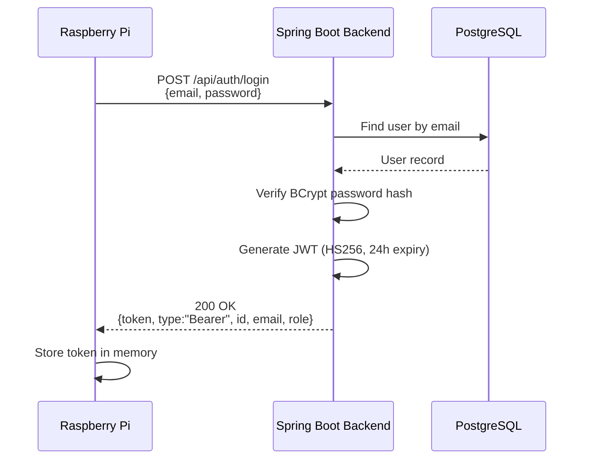
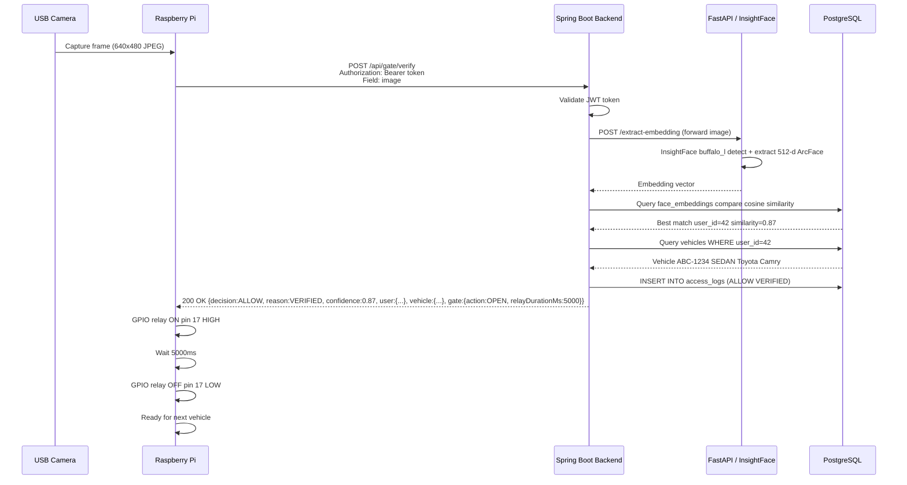
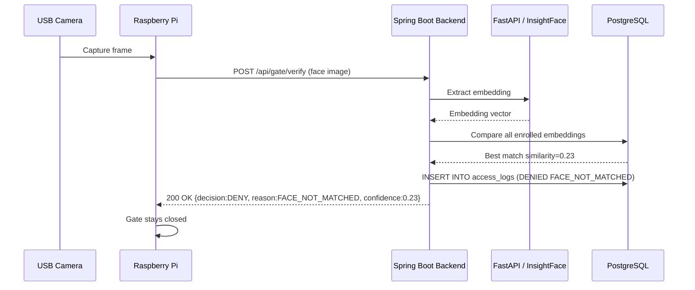
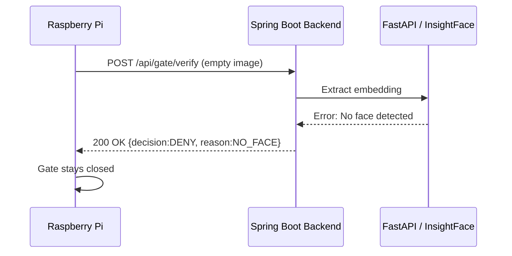
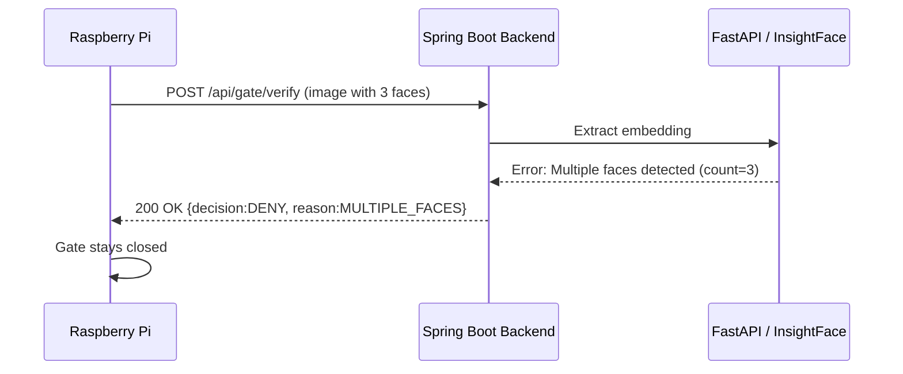
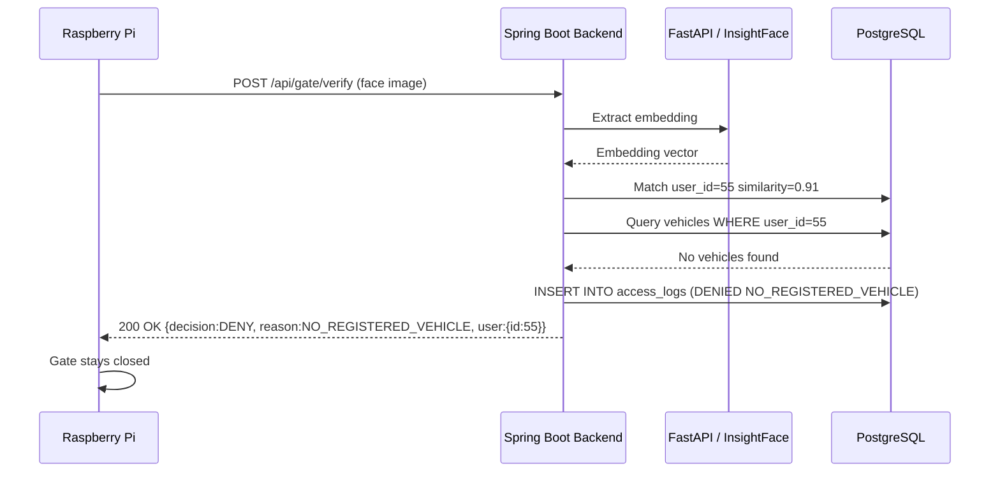
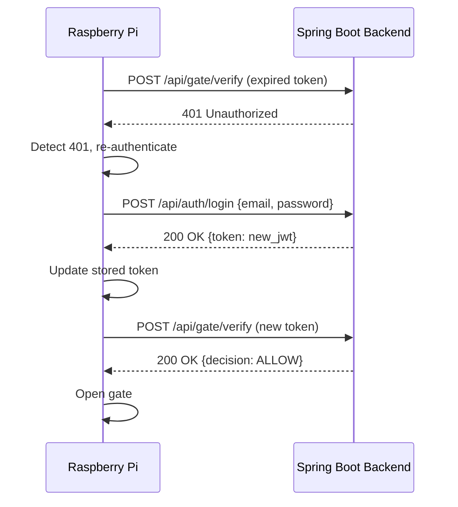
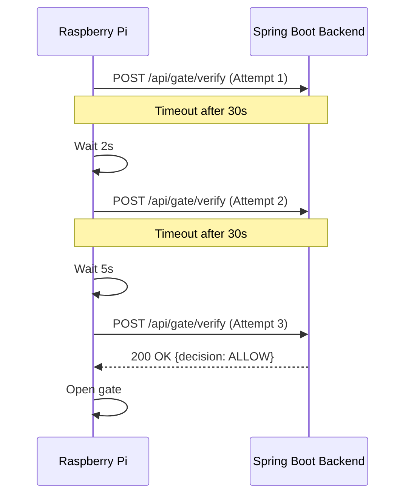
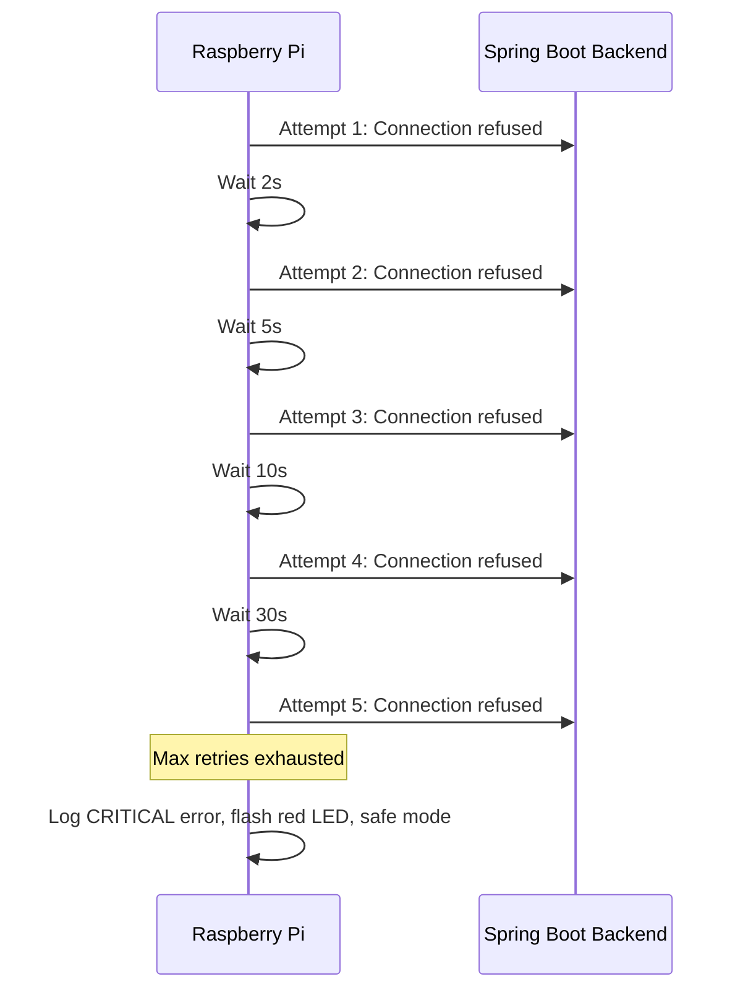
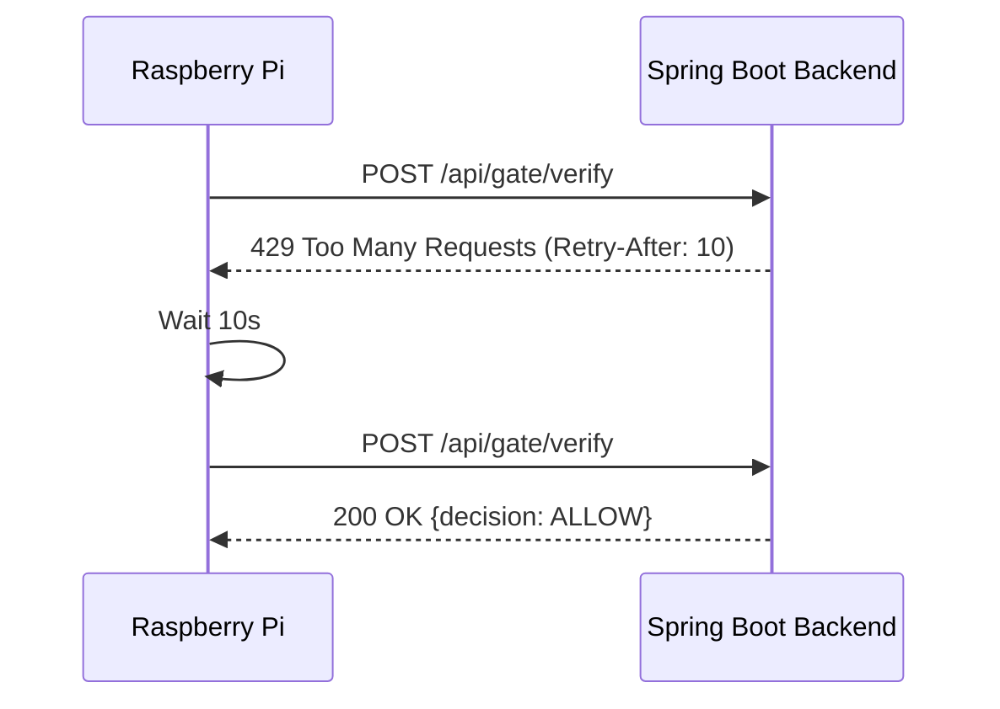

# CityParking Gate SDK — Sequence Diagrams

All diagrams use [Mermaid](https://mermaid.js.org/) syntax.

---

## 1. Device Authentication



## 2. Gate Verification — Access Granted



## 3. Gate Verification — Face Not Matched



## 4. No Face Detected



## 5. Multiple Faces Detected



## 6. User Has No Vehicle



## 7. Token Expired — Re-authentication



## 8. Network Timeout — Retry Logic



## 9. Backend Unavailable — Max Retries



## 10. Rate Limited (429)



## 11. Full System Startup

```mermaid
sequenceDiagram
    participant Pi as Raspberry Pi
    participant Camera as USB Camera
    participant GPIO as GPIO Relay
    participant Backend as Spring Boot Backend

    Pi->>Pi: Load config.json
    Pi->>Camera: Open camera (index from config)
    Camera-->>Pi: Camera ready
    Pi->>GPIO: Setup relay pin (BCM 17 OUTPUT)
    GPIO-->>Pi: Pin configured
    Pi->>Backend: POST /api/auth/login
    Backend-->>Pi: JWT token

    loop Main Loop
        Pi->>Camera: Capture frame
        Camera-->>Pi: JPEG image
        Pi->>Backend: POST /api/gate/verify
        Backend-->>Pi: Decision response
        alt ALLOW
            Pi->>GPIO: Relay ON
            Pi->>Pi: Wait relayDurationMs
            Pi->>GPIO: Relay OFF
        else DENY
            Pi->>Pi: Stay ready
        end
    end